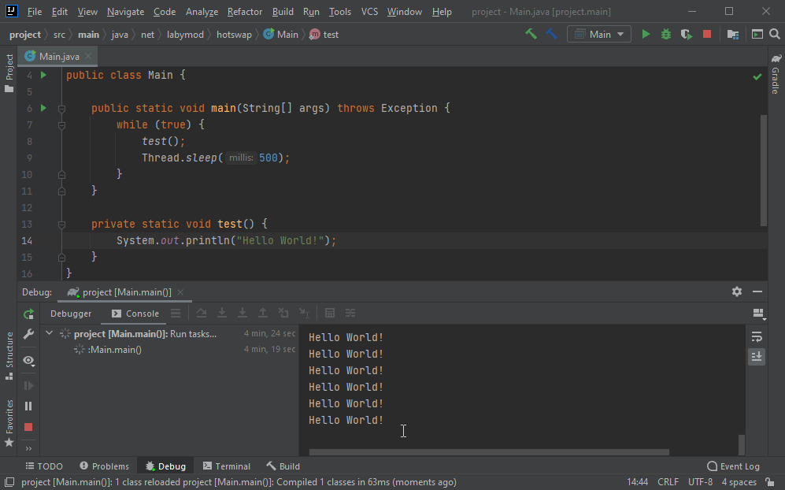
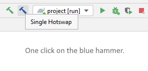
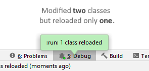
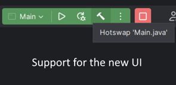

# Single Hotswap for IntelliJ 

### Download from [IntelliJ Marketplace](https://plugins.jetbrains.com/plugin/14832-single-hotswap)

With this plugin you can hotswap **50x faster** than usual by hotswapping **only the file opened** in the editor with
the **internal compiler** of IntelliJ. The built-in feature of Intellij "Compile and Reload" always reloads every single file that is referenced by the target
class. 
Therefore, this plugin gives you a better control what exactly you want to hotswap.

**If you are using a build tool like Gradle or Maven, you can avoid the need of a full rebuild by using this plugin.**

*It will provide a blue hammer next to the green "Build Project" hammer.* 
*Supports Java, Kotlin and Groovy*

